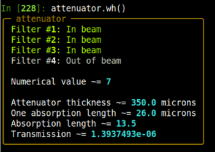
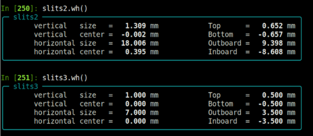

..  
   This document was developed primarily by a NIST employee. Pursuant
   to title 17 United States Code Section 105, works of NIST employees
   are not subject to copyright protection in the United States. Thus
   this repository may not be licensed under the same terms as Bluesky
   itself.

   See the LICENSE file for details.

.. role:: boldred

.. _coordinated:

Motors and Coordinated Motions
==============================

All axes of the XRD end station are implemented as EPICS motors.
Instruments like the slits or the table have pseudo motors implemented
for coordinated motion.  

The use of pseudo motors for coordinated motion is **strongly
recommended** for day-to-day use.

.. _goniometer_axes:

Goniometer axes
---------------

=============  ======================================
 name            purpose
=============  ======================================
 ``delta``       vertical 2\ |theta|
 ``eta``         vertical |theta|
 ``chi``         chi
 ``phi``         phi
 ``mu``          horizontal 2\ |theta|
 ``nu``          horizontal |theta|
 ``anal``        analyzer |theta|
 ``det``         analyzer 2\ |theta|
 ``dethor``      detector horizontal motion
 ``wheel1``      attenuator wheel
 ``shield``      scatter shield vertical motion
 ``samplex``     sample X
 ``sampley``     sample Y
 ``samplez``     sample Z
=============  ======================================
 
All of these motors can be moved using standard movement plans, e.g.:

.. code-block:: python

   RE(mvr(eta, 0.2))
   RE(mv(delta, 7.1)) 

A motor position is found, for example, by:

.. code-block:: python

   chi.position

Individual slits and table axes are documented below.

.. _goniometer_slits:

Slits
-----

The goniometer slit motors and coordinated motions:

===================  =================================================
 pseudo motor         purpose
===================  =================================================
 ``slits.hsize``      horizontal size
 ``slits.hcenter``    horizontal center position
 ``slits.vsize``      vertical size
 ``slits.vcenter``    vertical center position
===================  =================================================

===================  =================================================
 physical motor       purpose
===================  =================================================
 ``slits.t``          top slit blade
 ``slits.b``          bottom slit blade
 ``slits.i``          inboard slit blade
 ``slits.o``          outboard slit blade
===================  =================================================

Both physical and pseudo motors can be moved using standard movement
plans, e.g.:

.. code-block:: python

   RE(mvr(slits.vsize, 0.2))
   RE(mv(slits.b, 0.1)) 

The position of a physical or pseudo motor can be found, for example,
by:

.. code-block:: python

   slits.hsize.position
   slits.t.position

.. attention::

   The goniometer slits *do not* follow the standard NSLS-II
   coordinate system.  The positive/negative direction for all four
   blades is away from/towards the slit center.  Thus, `these slits
   <https://github.com/NSLS2/bmm_tools/blob/main/src/bmm_tools/devices/slits.py#L71>`__
   are configured differently from `the post-mono and hutch slits <https://github.com/NSLS2/bmm_tools/blob/main/src/bmm_tools/devices/slits.py#L11>`__.

You can get a report about the slit positions written to the screen
with:

.. code-block:: python

   slits.wh()

.. _fig-slitswh:
.. figure:: _images/coordinated/slits_wh.png
   :target: _images/slits_wh.png
   :width: 70%
   :align: center

   The slit positions report

.. _attenuator:

Attenuator
----------

The attenuator box is implemented as an actuator in Bluesky.  This
means it's setting can be changed with the ``mv()`` command:

.. code-block:: python

   RE(mv(attenuator, 3))

where the target position is the binary representation of the
attenuator foils.  In this example, position 3 means that foils #1 and
#2 are in the beam path.

As there are four foils in the attenuator holder of thicknesses 1, 2,
4, and 8. So, valid positions are any integer between 0 and 15,
inclusive.

This implementation allows the attenuator setting to be hinted, thus
reportable like any motor axis or scalar.  It can show up in the
best-effort callback table printed to the screen, it can be a record
of a measurement, it can be written to an output file or included in a
plot.

You can get the current numerical value of the attenuator by:

.. code-block:: python

   attenuator.attenuation.position

You can get a report about the attenuator status written to the screen
with:

.. code-block:: python

   attenuator.wh()

.. _fig-attenuatorwh:

   The attenuator status report

.. _goniometer_table:

Goniometer table
----------------

The goniometer table physical and pseudo motors:

=====================  =================================================
 pseudo motor           purpose
=====================  =================================================
 ``table.vertical``     vertical motion
 ``table.horizontal``   horizontal motion
 ``table.pitch``        pitch (rotation about X)
 ``table.roll``         roll (rotation about Z)
 ``table.yaw``          yaw (rotation about Y)
=====================  =================================================

===================  =================================================
 physical motor       purpose
===================  =================================================
 ``table.yuo``        upstream outboard Y jack
 ``table.yui``        upstream inboard Y jack
 ``table.yd``         downstream Y jack
 ``table.xu``         upstream X slide
 ``table.xd``         downstream X slide
===================  =================================================

Both physical and pseudo motors can be moved using standard movement
plans, e.g.:

.. code-block:: python

   RE(mvr(table.vertical, 0.2))
   RE(mv(table.yuo, 4.41)) 

The position of a physical or pseudo motor can be found, for example,
by:

.. code-block:: python

   table.lateral.position
   table.yd.position

The positions of the table motors and pseudomotors can be seen with

.. code-block:: python

   table.wh()

.. _fig-tablewh:
.. figure:: _images/coordinated/table_wh.png
   :target: _images/table_wh.png
   :width: 70%
   :align: center

   The table position report

.. _pds:

Photon delivery system
----------------------

Full control over the photon delivery system is given using the same
code as is used for the XAS end station.  While and experiment
performed a the standard energy of 8.6 keV probably won't need to
touch the photon delivery system, the are several situations where
this might be helpful, for example:

+ adjust the yaw or bend of the focusing mirror
+ change to a different energy
+ adjust either the post-mono or hutch slits
+ retune the pitch of the monochromator

.. _shutters:

Shutters
~~~~~~~~

**Open and close the photon shutter**
   In the nomenclature of BMM, the photon shutter is ``shb``.  Open
   and close this shutter with::

     shb.open()
     shb.close()

   These plans are somewhat more elaborate than simply toggling the
   state of the shutters.  It happens from time to time that the
   shutter does not trigger when told to open or close.  So, these
   plans try up to three times to open or close the photon shutter,
   with a 1.5 second pause between attempts.

   If you wish to open or close the photon shutter (using the same
   multiple attempt algorithm) in a plan, do::

     yield from shb.open_plan()
     yield from shb.close_plan()

**Open and close the safety shutter**
   This is the front-end shutter.  Closing it takes light off the
   monochromator, which is not something you typically want to do
   during an experiment.  That said, the safety shutter is ``sha`` in
   the BMM nomenclature::

     sha.open()
     sha.close()

   and::

     yield from sha.open_plan()
     yield from sha.close_plan()

Monochromator
~~~~~~~~~~~~~

.. todo:: show dcm report, explain how to change energy, tabulate dcm
	  motor names

.. _focusing_mirror:

Focusing mirror
~~~~~~~~~~~~~~~

The focusing mirror is driven to the correct location when setting up
for XRD operations.  That said, adjustments to the mirror might be
needed to optimize the beam delivery to the goniometer.  For example,
adjustments to the yaw, e.g.:

.. code-block:: python

   RE(mvr(m2.yaw, 0.01))

can fine tune the orientation of the focused beam such that the axes
of the elliptical beam shape are parallel to the goniometer slit
blades.

Adjusting the bender can be used to optimize the vertical focus of the
beam, e.g.:

.. code-block:: python

   RE(mvr(m2.bender, 5000))

Adjusting the pitch of M2 can be used along with the bender to
optimize the horizontal focus, e.g.:

.. code-block:: python

   RE(mvr(m2.pitch, 0.01))

although the horizontal beam size will always be large than the
vertical.

The positions of the focusing mirror motors and pseudomotors can be
seen with

.. code-block:: python

   m2.wh()

.. _fig-mirrorswh:
.. figure:: _images/coordinated/mirrors_wh.png
   :target: _images/mirrors_wh.png
   :width: 75%
   :align: center

   The position reports for the focusing and harmonic rejection
   mirrors

Harmonic rejection mirror
~~~~~~~~~~~~~~~~~~~~~~~~~

The harmonic rejection mirror is not used at 8.6 keV, nor at any
energy above 8 keV.

It would be needed for any energy below 8 keV, but the goniometer has
never been commissioned for operations below 8 keV.  Doing so would be
a significant project.  It is not known if the table jacks have enough
range of motion to accommodate lower energies.

The positions of the harmonic rejection mirror motors and pseudomotors
can be seen with

.. code-block:: python

   m3.wh()

as shown in :numref:`Figure %s <fig-mirrorswh>`.

Post-mono and hutch Slits
~~~~~~~~~~~~~~~~~~~~~~~~~

For XRD operations, the standard setting of the upstream slits are 18
mm by 1.3 mm for the post-mono slits and 7 mm by 1 mm for the hutch
slits. The goniometer slits are used to clean up the incident beam in
a way that is approriate for the scattering experiment.

The positions of the post-mono and hutch slits can be seen with:

.. code-block:: python

   slits2.wh()
   slits3.wh()

.. _fig-pdsslitswh:

   The position reports for the post-mono and hutch slits

