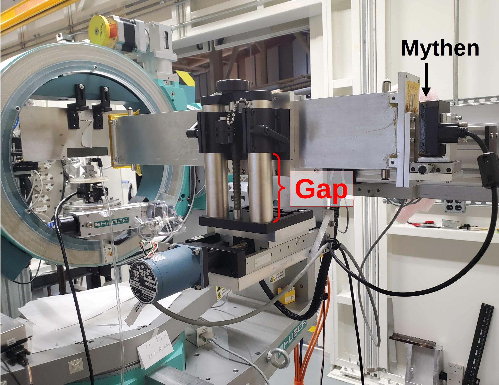

..  
   This document was developed primarily by a NIST employee. Pursuant
   to title 17 United States Code Section 105, works of NIST employees
   are not subject to copyright protection in the United States. Thus
   this repository may not be licensed under the same terms as Bluesky
   itself.

   See the LICENSE file for details.

.. _detectors:

Detectors
=========

Monitor
-------

The "monitor" refers to the scalar measuring input beam
intensity. This might be a Bicron or an avalanche photodiode (APD). In
either case, the signal is read using a `Struck scalar/counter board
<https://www.struck.de/sis3800.htm>`__ in the VME crate in rack D,
shown in :numref:`Figure %s <fig-struck>`.

The Bicron uses channel 25 of the Struck, the APD uses channel 26.

.. admonition:: Future tech!

   The VME is legacy equipment. It's only current use at BMM is for
   reading the XRD monitor signal.  It would be nice to move away from
   the VME crate.

.. _fig-struck:
.. figure:: _images/detectors/struck.jpg
   :target: _images/struck.jpg
   :width: 70%
   :align: center

   The VME crate holding the Struck SIS36/38xx scalar/counter board.

The measured monitor signal comes from the scattering of the incident
beam from a sheet of plastic into the Bicron (or APD). This is shown
in :numref:`Figure %s <fig-incident_beam>`.  

.. _fig-incident_beam:
.. figure:: _images/detectors/incident_beam.jpg
   :target: _images/incident_beam.jpg
   :width: 70%
   :align: center

   The incident beam assembly for the goniometer, showing the slits,
   the attenuator box, and the Bicron monitor.

Either the Bicron or the APD is set as the monitor for the experiment.
This is set by this command:

.. code-block:: python

   set_monitor('bicron')

The default is for the Bicron to be the monitor.  The APD can be set
as the monitor by giving ``apd`` as the argument to the
``set_monitor()`` command.

The struck detectors can be measured by doing

.. code-block:: python

   RE(count([struck], 1))

This will display a table on screen showing the monitor counts under a
heading of ``monitor`` (i.e. not "Bicron" or "APD").

The monitor will be included in the detector list for any alignment or
measurement plan.  That is, the monitor will always be included in any
measurement. 

Mythen
------

`Dectris Mythen2 <https://dectris.com/en/detectors/x-ray-detectors/mythen2/>`__

.. _fig-mythen:

   The Mythen2 mounted on the delta arm of the goniometer.

Count on the Mythen:

.. code-block:: python

   RE(count([mythen], 1))

This will show a table on screen of the signals in the three ROIs.

ROIs:

==============   =====================================================
 ROI              description
==============   =====================================================
 ``mca_full``     The integral of the entire detector
 ``dir``          The direct beam, a tight ROI around the main signal
 ``refl``         The reflected beam, a wider ROI than ``dir``
==============   =====================================================

Plot most recent exposure of the Mythen:

.. code-block:: python

   mythen.plot(N)

where the argument displays an ROI boundary. N=0 shows the
``mca_full`` ROI boundaries.  N=1 shows the ``dir`` ROI boundary.  N=1
shows the ``refl`` ROI boundary.

Eiger
-----

`Dectris Eiger2S <https://dectris.com/en/detectors/x-ray-detectors/eiger2/>`__

.. admonition:: Future tech!

   Integrate the Eiger and use it for pole figure measurements.

.. _fig-eiger:
.. figure:: _images/detectors/eiger.jpg
   :target: _images/eiger.jpg
   :width: 70%
   :align: center

   The Eiger2S 4M detector.

Pilatus
-------

`Dectris Pilatus 100K
<https://media.dectris.com/Technical_Specification_PILATUS_100K-S_V1_8.pdf>`__.
Note, we have an older model of this detector.

.. note:: Compare to the Eiger, our Pilatus is older and smaller, has
	  fewer features, and is more complicated to integrate.  The
	  Pilatus is still useful, though, and will be fully supported
	  by the goniometer profile.

.. _fig-pilatus:
.. figure:: _images/detectors/pilatus.jpg
   :target: _images/pilatus.jpg
   :width: 70%
   :align: center

   The Pilatus 100K detector.

Optical Cameras
---------------

.. note:: Optical cameras, currently USB, moving to gigE.
