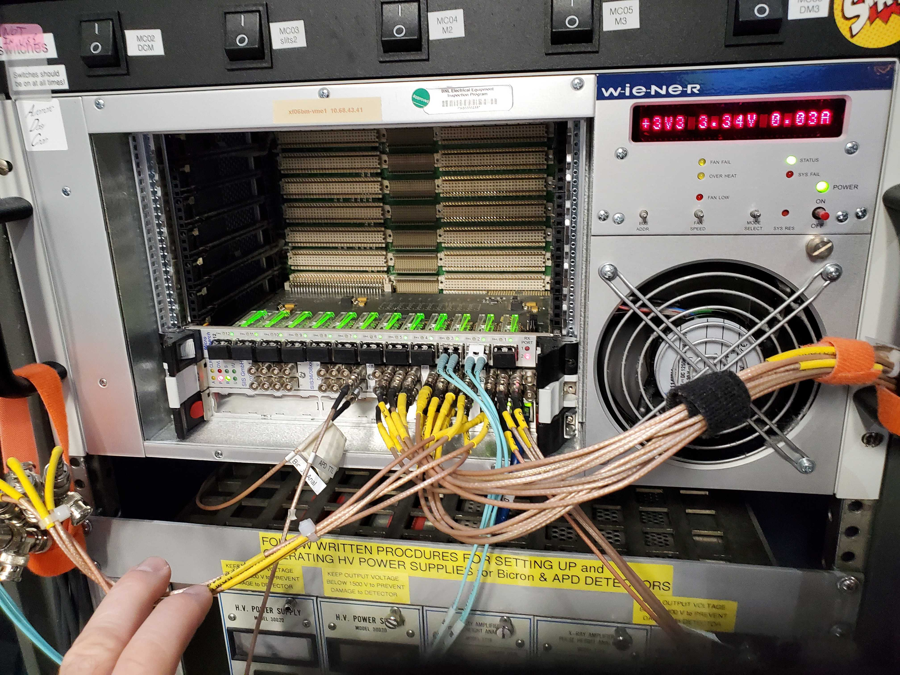
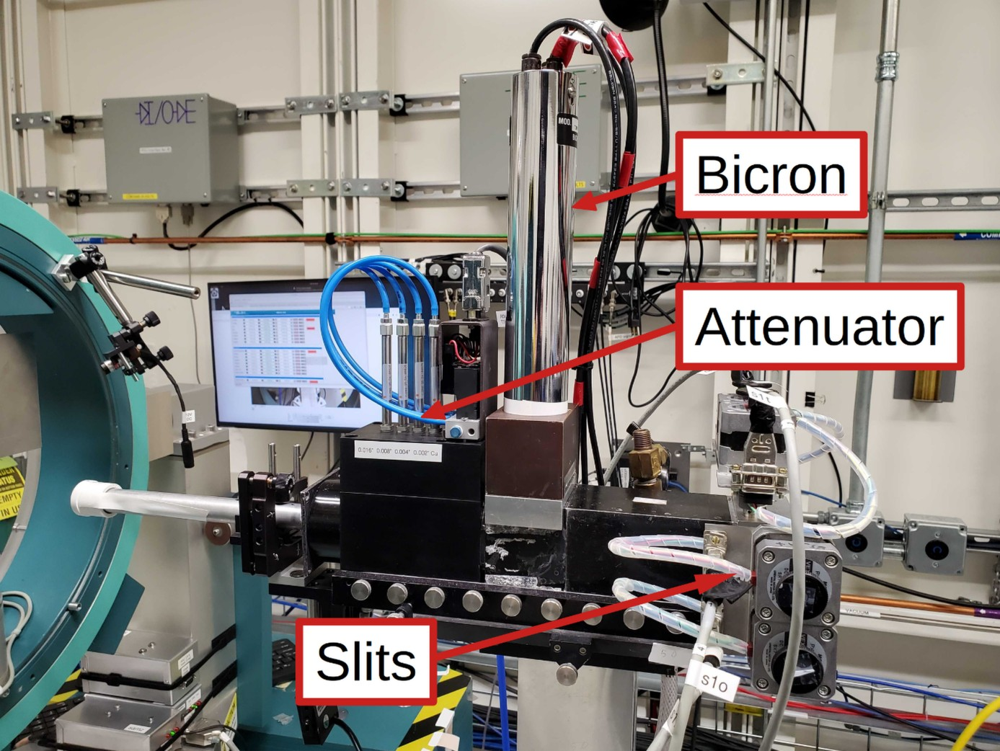
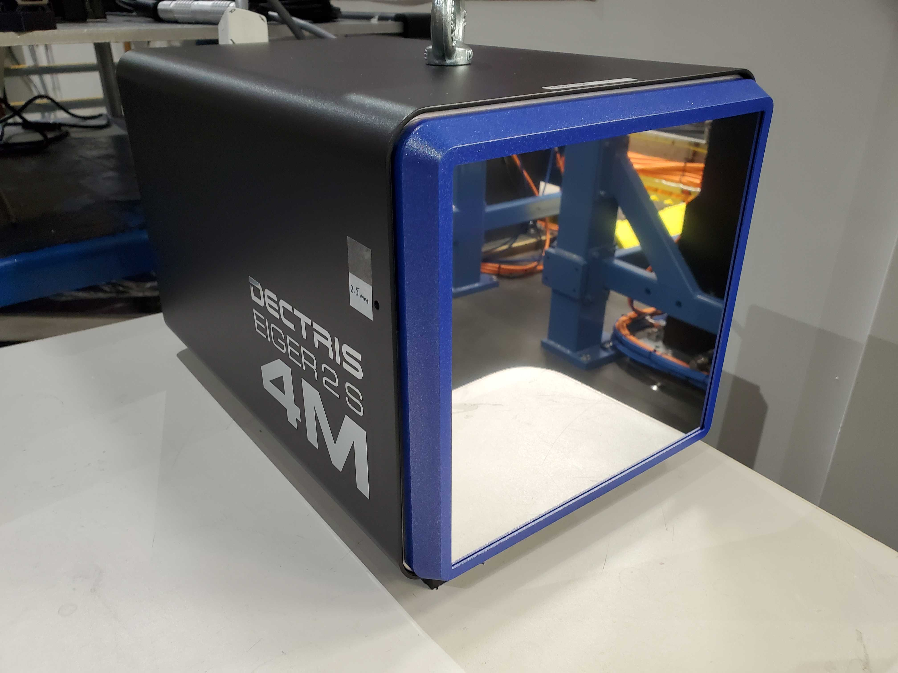
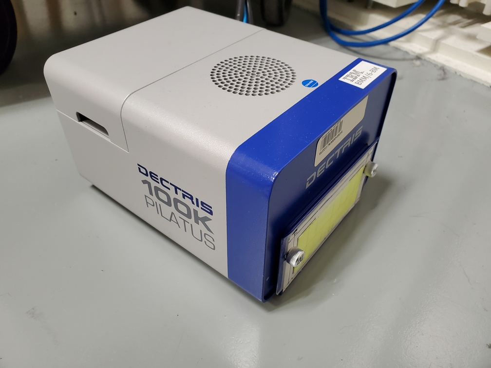

..  
   This document was developed primarily by a NIST employee. Pursuant
   to title 17 United States Code Section 105, works of NIST employees
   are not subject to copyright protection in the United States. Thus
   this repository may not be licensed under the same terms as Bluesky
   itself.

   See the LICENSE file for details.

.. _detectors:

Detectors
=========

.. _dwelltime:

Measurement Time
----------------

Each kind of detector has a parameter that relates to the length of an
individual measurement.  For an electrometer, this might be called an
averaging time, for a counter it might be called a count time or
integration time, for an area detector or a camera it might be called
an exposure time.

In this |bsui| profile, each such parameter of each detector in use is
identified and configured in such a way that a single object is
used to set the measurement time correctly for each detector in use.

This is done in a way that uses the same syntax as any of the motors
discussed in :numref:`Section %s <coordinated>`.  Measurement times
are controlled by an object called ``dwell_time``.  To see the current
value of the measurement time:

.. code-block:: python

   dwell_time.position

and to set a new measurement time:

.. code-block:: python

   RE(mv(dwell_time, 0.5))

So, if you want to take a 5 second exposure on the :numref:`Mythen
(Section %s) <mythen>` detector and include the :numref:`monitor
(Section %s) <monitor>` signal, you could do:

.. code-block:: python

   RE(mv(dwell_time, 5))
   RE(count([struck, mythen], 1))

Some of the alignment scans discussed in :numref:`Section %s <align>`
as well as the XRR scan discussed in :numref:`Section %s <xrr>` will
either take a measurement time argument to the function call or will
set a default measurement time by setting the ``dwell_time`` parameter
accordingly.

.. _monitor:

Monitor
-------

The "monitor" refers to the scalar measuring input beam
intensity. This might be a Bicron or an avalanche photodiode (APD). In
either case, the signal is read using a `Struck scalar/counter board
<https://www.struck.de/sis3800.htm>`__ in the VME crate in rack D,
shown in :numref:`Figure %s <fig-struck>`.

The Bicron uses channel 25 of the Struck, the APD uses channel 26.

.. admonition:: Future tech!

   The VME is legacy equipment. It's only current use at BMM is for
   reading the XRD monitor signal.  It would be nice to move away from
   the VME crate.

.. _fig-struck:

   The VME crate holding the Struck SIS36/38xx scalar/counter board.

The measured monitor signal comes from the scattering of the incident
beam from a sheet of plastic into the Bicron (or APD). This is shown
in :numref:`Figure %s <fig-incident_beam>`.  

.. _fig-incident_beam:

   The incident beam assembly for the goniometer, showing the slits,
   the attenuator box, and the Bicron monitor.

Either the Bicron or the APD is set as the monitor for the experiment.
This is set by this command:

.. code-block:: python

   set_monitor('bicron')

The default is for the Bicron to be the monitor.  The APD can be set
as the monitor by giving ``'apd'`` as the argument to the
``set_monitor()`` command.

The struck detectors can be measured by doing

.. code-block:: python

   RE(count([struck], 1))

This will display a table on screen showing the monitor counts under a
heading of ``monitor`` (i.e. not "Bicron" or "APD").

The monitor will be included in the detector list for any alignment or
measurement plan.  That is, the monitor will always be included in any
measurement. 

.. _i0:

Upstream ion chamber
--------------------

The upstream ion chamber |nd| I0 in an XAS experiment |nd| is
available as ``ic0``.  This i sthe ion chamber just after the
:numref:`slits (Section %s) <blslits>` in diagnostic module 3 and just
before the evacuated transport pipe.

.. _fig-ic0:
.. figure:: _images/detectors/i0.jpg
   :target: _images/i0.jpg
   :width: 70%
   :align: center

   The upstream ion chamber

You can count it like so:

.. code-block:: python

   RE(count([ic0], 1))

While not used for any scattering experiments, this detector is
essential for other chores, including changing energy on the
monochromator and providing a feedback signal to keep the beam on the
goniometer slits.

.. _mythen:

Mythen
------

Vendor web page for the `Dectris Mythen2
<https://dectris.com/en/detectors/x-ray-detectors/mythen2/>`__.

Should you find the Mythen IOC unresponsive, the solution is usually
to power cycle the Mythen controller and restart the IOC.  The
controller can be power cycled using the power switch on the back side
of the small, black box shown in :numref:`Figure %s <fig-mythen>`.
The IOC is running on ``xf06bm-det-ioc1``.  ssh to that machine, then
use your BNL credentials to do

.. code-block:: bash

   dzdo manage-iocs restart mythen-det2

Once restarted, you may need to restart |bsui| to connect to the IOC.

.. note:: Only beamline and DSSI staff can restart IOCs

.. subfigure::  AB
   :layout-sm: AB
   :gap: 8px
   :subcaptions: above
   :name: fig-mythen
   :class-grid: outline

   .. image:: _images/align/gap.jpg

   .. image:: _images/detectors/mythen_controller.jpg

   (Left) The Mythen2 mounted on the delta arm of the goniometer.
   (Right) The Mythen controller secured to the table.

Count on the Mythen:

.. code-block:: python

   RE(count([mythen], 1))

This will show a table on screen of the signals in the three ROIs.

ROIs:

======= ==============   =====================================================
ROI #    ROI name         description
======= ==============   =====================================================
 1       ``mca_full``     The integral of the entire detector
 2       ``dir``          The direct beam, a tight ROI around the main signal
 3       ``refl``         The reflected beam, a wider ROI than ``dir``
======= ==============   =====================================================

The maximum count rate across all the strips of the Mythen is also
available as ``max_counts`` and is hinted, so will be included in the
on-screen table and available for plotting or other uses.

These scalars are individually accessible:

.. code-block:: python

   mythen.stats1.total.get()       # the integral over mca_full
   mythen.stats2.total.get()       # the integral over mca_dir
   mythen.stats3.total.get()       # the integral over refl
   mythen.stats1.max_value.get()   # the largest pixel value 

There is also a fourth ROI, ``mythen.roi4`` that is available but not
normally used.

Plot most recent exposure of the Mythen:

.. code-block:: python

   mythen.plot(N)

where the argument displays an ROI boundary. N=1 shows the
``mca_full`` ROI boundaries.  N=2 shows the ``dir`` ROI boundary.  N=3
shows the ``refl`` ROI boundary.

You can specify the X axis range like so:

.. code-block:: python

   mythen.plot(3, 190, 220)

That will limit the range of the plot to pixels 190 through 220.

.. todo:: Discuss the HDF5 files and how to find them.  Discuss using
	  data from HDF5 and from Tiled.

.. _eiger:

Eiger
-----

Vendor web page for the `Dectris Eiger2S
<https://dectris.com/en/detectors/x-ray-detectors/eiger2/>`__

For instructions on how to turn on the Eiger, initialize the detector,
and establish an ophyd connection, see the `notes on the Eiger from
the main beamline manual
<https://nsls2.github.io/bmm-beamline-manual/details.html#eiger2-si-4m>`__.

Here is a picture of the Eiger.  At this time (Aug 2026) we are still
waiting on a way to mount the Eiger on the delta arm of the goniometer.

.. _fig-eiger:

   The Eiger2S 4M detector.

The object for the Eiger is called ``eiger``.  Like any other
detector, it can be counted

.. code-block:: python

   RE(count([eiger], 1))

This will show a table on screen of the signals in the three ROIs.

ROIs:

==============   =====================================================
 ROI              description
==============   =====================================================
 ``mca_full``     The integral of the entire detector
 ``dir``          The direct beam, a tight ROI around the main signal
 ``refl``         The reflected beam, a wider ROI than ``dir``
==============   =====================================================

.. note:: These ROI names are provisional.  The Eiger has not been
	  used for any actual measurements at the time of this
	  writing. (Aug 2026)

There are 4 ROIs defined for the Eiger.  The ROIs are defined by 4
integers: minimum values of X and Y, and the sizes in X and Y.  The
units of all four numbers is pixels, count from the top, left corner
of the detector.

``eiger.get_rois(N)``
   Get the 4 ROI settings for ROI #N, where N is 1, 2, 3, or 4.  This
   will print something like this to the screen:

   .. code-block:: text
      
      ROI1: 68 251 1525 45

   where the integers are minX, sizeX, minY, and sizeY.  It also 
   returns a tuple containing those setting in the same order.

``eiger.set_rois(N, (mx, sx, my, sy))``
   Set the 4 ROI settings for ROI #N, where N is 1, 2, 3, or 4.  The
   second argument is a tuple containing minX, sizeX, minY, and sizeY
   values in that order.

The default operation of the Eiger is make images of signed integer
value.  This gives a bit depth of 2\ :sup:`31`.  It also means that
the pixels in the area between the panes of the detector will have
value -1.  

With unsigned integers, the bit depth is 2\ :sup:`32`, but the pixels
in between the panes will have values of 2\ :sup:`31`-1.  That's
probably less convenient (in that it would require the subtraction of
a dark image), but it does double the dynamic range of the detector.

You can toggle between signed and unsigned integers with 

.. code-block:: python

   eiger.set_signed_data(True)   # signed integers
   eiger.set_signed_data(False)  # unsigned integers

The reason to want to do this is to readily visualize the locations of
areas between the panes, even when there is no signal on the detector.
Here are examples of dark images using signed and unsigned integers.

.. subfigure::  ABC
   :layout-sm: ABC
   :gap: 8px
   :subcaptions: above
   :name: fig-eiger_datatype
   :class-grid: outline

   .. image:: _images/detectors/eiger_signed.png

   .. image:: _images/detectors/eiger_unsigned.png

   .. image:: _images/detectors/eiger_counting.png

   (Left) An Eiger dark image using signed integer images.
   (Middle) An Eiger dark image using unsigned integer images.  Here
   the margins between panes are clearly visible, as are bad pixels
   and pixels illuminated by some form of noise.
   (Right) The bsui command line while measuring these images.  Note
   that the noise pixels result in very large values for one of the
   ROIs in the unsigned integer measurement, while all three ROIs are
   small for signed integers.

.. _pilatus:

Pilatus
-------

`Dectris Pilatus 100K
<https://media.dectris.com/Technical_Specification_PILATUS_100K-S_V1_8.pdf>`__.
Note that we have an older model of this detector.

.. note:: Compared to the Eiger, our Pilatus is older and smaller, has
	  fewer features, and is more complicated to integrate.  The
	  Pilatus is still useful, though, and will be fully supported
	  by the goniometer profile.

.. note:: The interface to the Pilatus is identical to the Eiger.  The
	  commands described above for setting and getting ROI values
	  on the ``eiger`` work the same for ``pilatus``.  There is no
	  signed data setting on the Pilatus.

.. _fig-pilatus:

   The Pilatus 100K detector.

.. _cameras:

Optical Cameras
---------------

.. note:: Optical cameras, currently USB, moving to gigE.
